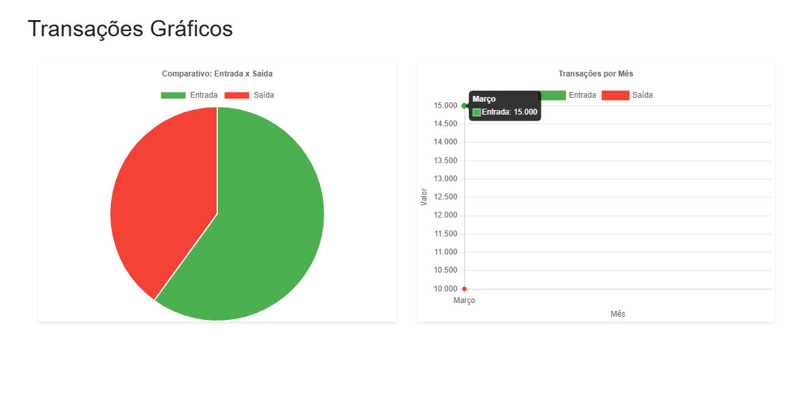

# Gerenciamento de Movimentações Financeiras

[](https://vuejs.org/)
[](https://laravel.com/)
[](https://www.mysql.com/)

Este projeto é um desafio fullstack que visa oferecer uma solução completa para a gestão de transações financeiras. A aplicação possibilita o cadastro e autenticação de usuários, permitindo o gerenciamento de movimentações (entradas e saídas) e categorias associadas. Desenvolvida com **Vue 3** no frontend e **Laravel 11+** no backend, ela integra uma experiência moderna e responsiva, contando também com recursos adicionais como tipagem estática com **TypeScript**, estado global com **Pinia** e interface estilizada com **Vuetify**.

## Sumário

- [Gerenciamento de Movimentações Financeiras](#gerenciamento-de-movimentações-financeiras)
  - [Sumário](#sumário)
  - [Funcionalidades](#funcionalidades)
  - [Funcionalidades Extras](#funcionalidades-extras)
    - [Dark Mode Inteligente](#dark-mode-inteligente)
    - [Exportação de Dados](#exportação-de-dados)
    - [Visualização Gráfica Avançada](#visualização-gráfica-avançada)
    - [Funcionalidades Técnicas](#funcionalidades-técnicas)
  - [Tecnologias](#tecnologias)
    - [Frontend](#frontend)
    - [Backend](#backend)
    - [DevOps \& Ferramentas](#devops--ferramentas)
  - [Pré-requisitos](#pré-requisitos)
  - [Instalação](#instalação)
    - [Método 1: Docker (Recomendado)](#método-1-docker-recomendado)
    - [Acesso aos Serviços](#acesso-aos-serviços)
    - [Método 2: Instalação Local](#método-2-instalação-local)
  - [Configuração do Banco de Dados](#configuração-do-banco-de-dados)
    - [1. Criação do Banco MySQL](#1-criação-do-banco-mysql)
    - [1. Configuração do Ambiente](#1-configuração-do-ambiente)
  - [Demostração](#demostração)
  - [Rotas da API (Endpoints)](#rotas-da-api-endpoints)
  - [Contato](#contato)

## Funcionalidades

- **Autenticação de Usuários**
  - Login com validação de credenciais
  - Proteção de rotas autenticadas

- **Gestão de Transações**
  - Tabela com histórico completo
  - Filtros por tipo (entrada/saída) e valor
  - CRUD completo de movimentações
  - Formulário com seleção de categorias
  - Visualização de saldo total

- **Gestão de Categorias**
  - Criação e exclusão de categorias
  - Listagem de categorias disponíveis
  - Validação de categorias em uso


## Funcionalidades Extras

### Dark Mode Inteligente
- **Toggle de Tema com Persistência**
  - Botão dedicado na barra de navegação
  - Alternância suave entre temas claro/escuro
  - Preferência salva em localStorage
  - Ícone dinâmico (sol/lua)
  - Compatível com todos os componentes

  

### Exportação de Dados
- **Relatórios em PDF Profissionais**
  - Layout otimizado para impressão
  - Cabeçalho com dados do usuário
  - Tabelas com formatação condicional
  - Download automático em 1 clique
  

  

- **Exportação para Excel**
  - Planilhas formatadas prontas para análise
  - Fórmulas pré-configuradas (totais, médias)
  - Tipagem correta de dados (moeda, datas)
  - Compatível com Google Sheets e Excel Online
  
  

### Visualização Gráfica Avançada
- **Gráfico de Pizza por Categorias**
  - Distribuição percentual de gastos
  - Legenda interativa com valores
  - Cores temáticas por categoria

- **Gráfico de Barras Temporais**
  - Evolução mensal de entradas/saídas
  - Comparativo entre meses

- **Dashboard Resumo**
  - Cards com métricas chave
  - Filtros dinâmicos por período
  - Atualização em tempo real
  
  

### Funcionalidades Técnicas
- Interface responsiva com **Vuetify 3**
- Tipagem estática com **TypeScript**
- Gerenciamento de estado com **Pinia**
- Comunicação API via **Axios**
- Sistema de notificações com toasts
- Filtros avançados com persistência

## Tecnologias

### Frontend
- **Vue 3**
- **TypeScript**
- **Vuetify**
- **Pinia**
- **Axios**
- **Chart.js**

### Backend
- **Laravel 11+**
- **Laravel Sanctum**
- **MySQL 8.0**
- **Maatwebsite**
- **Eloquent ORM**

### DevOps & Ferramentas
- **Docker**

## Pré-requisitos

- Node.js 18+
- PHP 8.1+
- Composer 2.6+
- MySQL 8.0+
- Docker (opcional para instalação containerizada)

## Instalação

### Método 1: Docker (Recomendado)

```bash
# Clone o repositório
git clone https://github.com/GabrielLima2803/desafio-tecnico-MF.git

# Entre no repositório
cd desafio-tecnico-MF

# Copie a as variveis de ambiente
cp backend/.env.example backend/.env

# Construa os containers
docker-compose build --no-cache

# Inicie os containers
docker-compose up 
```

Depois de subir os containers é para está igual a essa imagem


### Acesso aos Serviços
- Frontend: http://localhost:3000
- Backend: http://localhost:8000
- Banco de Dados MySQL: Disponível na rede interna na porta 3306

### Método 2: Instalação Local

**Backend (Laravel 11+)**
```bash
# Acesse o diretório do backend
cd backend

# Crie uma cópia do arquivo de ambiente
cp .env.example .env

# Configure o banco de dados no .env
DB_CONNECTION=mysql
DB_HOST=127.0.0.1
DB_PORT=3306
DB_DATABASE=finance_db
DB_USERNAME=root
DB_PASSWORD=sua_senha_aqui

Ou

# Use Sqlite
DB_CONNECTION=sqlite

# Instale as dependências
composer install

# Gere a chave da aplicação
php artisan key:generate

# Execute as migrações do banco
php artisan migrate

# Inicie o servidor Laravel
php artisan serve --port=8000
```

**Frontend (Vuejs3)**
```bash
# Acesse o diretório do frontend
cd frontend

# Instale as dependências
npm install

# Inicie o servidor de desenvolvimento
npm run dev
```

## Configuração do Banco de Dados

### 1. Criação do Banco MySQL
Execute no MySQL:
```sql
CREATE DATABASE finance_db;
CREATE USER 'finance_user'@'localhost' IDENTIFIED BY 'senha_forte';
GRANT ALL PRIVILEGES ON finance_db.* TO 'finance_user'@'localhost';
FLUSH PRIVILEGES;
```

### 1. Configuração do Ambiente
Edite o arquivo ``.env`` do backend com:

```bash
DB_CONNECTION=mysql
DB_HOST=127.0.0.1
DB_PORT=3306
DB_DATABASE=finance_db
DB_USERNAME=finance_user
DB_PASSWORD=senha_forte
```

## Demostração


## Rotas da API (Endpoints)

| Método | Endpoint                   | Descrição                   |
|--------|----------------------------|-----------------------------|
| POST   | `/api/login`               | Autenticação de usuário     |
| POST   | `/api/register`            | Registrar usuário           |
| GET    | `/api/transactions`        | Listar transações           |
| POST   | `/api/transactions`        | Criar transação             |
| GET    | `/api/transactions/{id}`   | Mostrar transação específica|
| PUT    | `/api/transactions/{id}`   | Atualizar transação         |
| DELETE | `/api/transactions/{id}`   | Excluir transação           |
| GET    | `/api/categories`          | Listar categorias           |
| POST   | `/api/categories`          | Criar categoria             |
| DELETE | `/api/categories/{id}`     | Excluir categoria           |


## Contato

- **Gabriel Lima de Souza**
- **gabriellima2803@gmail.com**
- **[LinkedIn](https://www.linkedin.com/in/gabriel-limadev/)**
